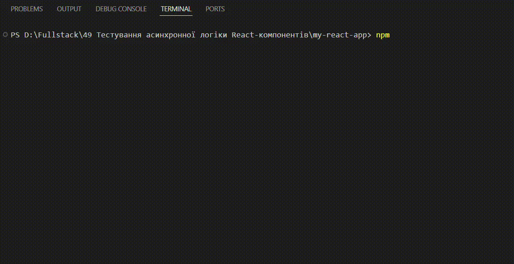

# Тестування асинхронної логіки React-компонентів



## Опис проекту

Цей проєкт демонструє реалізацію та тестування асинхронної логіки в
React-компоненті з використанням **Vite**, **TypeScript**, **Vitest** та
**React Testing Library**.

У застосунку реалізовано компонент `UserProfile`, який виконує
асинхронний GET-запит до API:

https://jsonplaceholder.typicode.com/users/1

Компонент обробляє три основні стани:

-   🔄 Стан завантаження (Loading)
-   ✅ Успішне отримання даних (Success)
-   ❌ Помилка запиту (Error)

Також у проєкті реалізовано ізольоване тестування компонента з
використанням мокування API-запиту.

------------------------------------------------------------------------

## Технології

-   React
-   TypeScript
-   Vite
-   Vitest
-   React Testing Library

------------------------------------------------------------------------

## Функціональність

Компонент `UserProfile`:

-   Виконує асинхронний запит до API
-   Відображає індикатор завантаження
-   Виводить отримані дані у вигляді таблиці
-   Показує повідомлення про помилку у разі невдалого запиту

------------------------------------------------------------------------

## Тестування

Написані тести перевіряють:

1.  Відображення індикатора завантаження
2.  Коректне відображення даних після успішного запиту
3.  Відображення повідомлення про помилку при невдалому запиті

Для ізоляції тестів використано мокування API через `vi.mock`, що
дозволяє не залежати від зовнішнього сервісу.

Результат успішного проходження тестів продемонстровано у вигляді
анімації в інтерфейсі застосунку.

------------------------------------------------------------------------

## Встановлення та запуск

### Встановлення залежностей

``` bash
npm install
```

### Запуск застосунку

``` bash
npm run dev
```

### Запуск тестів

``` bash
npm run test
```

------------------------------------------------------------------------

## Структура проекту

    src/
     ├── api/
     │    └── userApi.ts
     ├── components/
     │    ├── UserProfile.tsx
     │    └── UserProfile.test.tsx
     ├── setupTests.ts
     └── App.tsx

------------------------------------------------------------------------

## Результат

Усі тести проходять успішно.\
Проєкт реалізовано відповідно до вимог завдання: використано Vite,
створено компонент з асинхронною логікою, написано тести з мокуванням
API та додано документацію.
